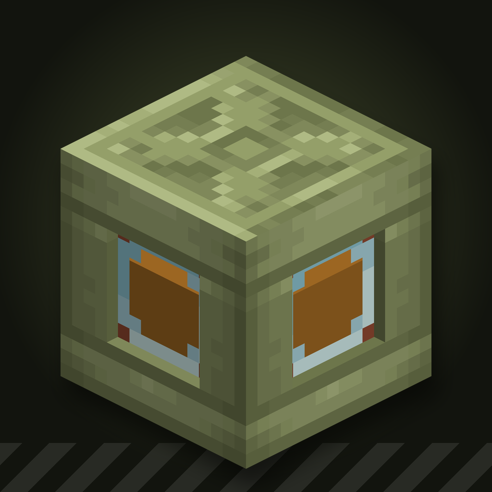

# Create: Vehicle Surplus

Compact vehicle parts for [Create](https://modrinth.com/mod/create) on NeoForge 1.21.1. Made for
Create Aeronautics / Simulated builds, and they work anywhere else too.

## Blocks

- **Fuel Tank**: a Create Fluid Tank that feeds every Diesel Generators engine touching it. No
  pumps or pipes, and only fluids the engine burns go in. Redstone on any block of the tank
  stops the feed.
- **Long Fuel Tank**: the same tank lying down, a 1x1 tube up to 8 blocks long.
- **Differential**: a Gearbox whose outputs all turn the input's way, for driven axles.
- **Transmission**: an inline gearbox with Reverse, Neutral and gears 1/4, 1/2, 3/4 and 1:1.
  Each long face has built-in Redstone Link slots: Up and Down shift a gear, Analog picks the
  gear by signal strength, Neutral locks the output.

Every block has a Ponder scene.

## Compatibility

- **Create Propulsion: Simulated** (optional): Fuel Tanks also feed its liquid thrusters.
- **CC: Tweaked** (optional): the Transmission is a `transmission` peripheral with `getGear`,
  `setGear`, `shiftUp`, `shiftDown`, `getRatio`, `getInputSpeed`, `getOutputSpeed` and
  `getControl`.

## Requirements

| Mod | Version |
|---|---|
| NeoForge | 21.1.219+ |
| Create | 6.0.10 – 6.0.x |
| Create Diesel Generators | 1.21.1-1.3.15+ |
| Create Propulsion: Simulated | 1.1.5+ (optional) |
| CC: Tweaked | 1.113+ (optional) |
